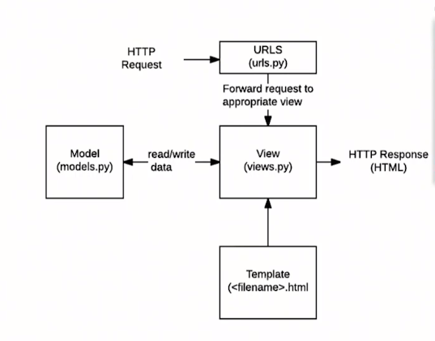

# What is Django

> 파이썬으로 작성된 웹 프레임워크

- **MTV** 패턴
  - Model : 데이터관리 
  - Template : 인터페이스(화면)
  - View : 중간관리(상호동작)



# Django_Basic

## 설치하기

```bash
$ pip install django==2.1.15
```


## Django Project 시작

### 프로젝트 생성

```bash
$ django-admin startproject 프로젝트명
```

- 원하는 프로젝트명을 입력한다. 

  (아래 내용은 `django_intro`를 프로젝트 명으로 사용할 것.)

- 프로젝트 생성 후 `ls`명령어를 통해 `manage.py` 파일을 확인한다.


### 서버실행

- `django_intro`폴더의 `settings.py` 파일을 아래와 같이 수정한다.

```python
# 28번째 라인
ALLOWED_HOSTS = ['*']

# 106번째 라인
LANGUAGE_CODE = 'ko-kr'

# 108번째 라인
TIME_ZONE = 'Asia/Seoul'
```

- 반드시 서버 실행 시, 명령어가 실행되는 디렉토리를 확인할 것!

```bash
~/ $ cd django_intro/
~/django_intro/ $ python manage.py runserver 8080
```

- `python manage.py runserver 8080` 로 서버 실행 후 우측의 url 클릭
- 서버 종료는 Terminal에서 `Ctrl + C` 입력


### 리눅스 명령어

- **cd** : change directory

  ```bash
  #  django_intro 폴더로 이동
  ~/ $ cd django_intro/
  ~/django_intro $
  # 상위 디렉토리로 이동
  ~/django_intro $ cd ..
  ~/ $
  # ~/ 로 이동
  home/ $ cd
  ~/ $
  ```

- **ls** : 현재 디렉토리 파일 목록

  ```bash
  ~/django_intro $ ls
  db.sqlite3  django_intro/  manage.py*
  ```

- **mkdir** : make directory

- **touch** : make file
