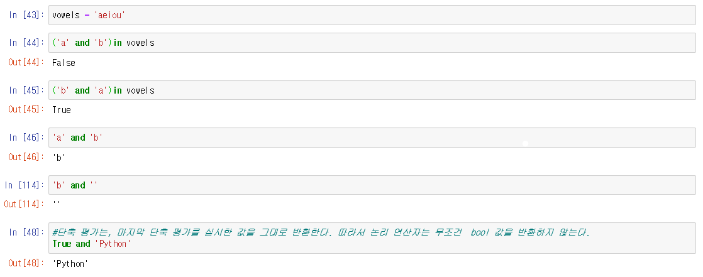
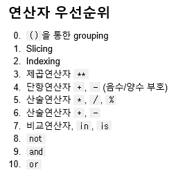
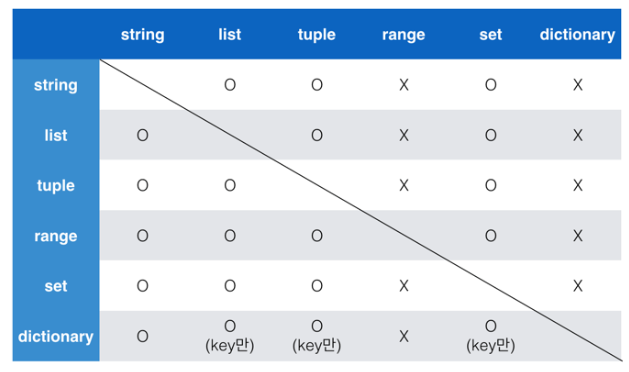
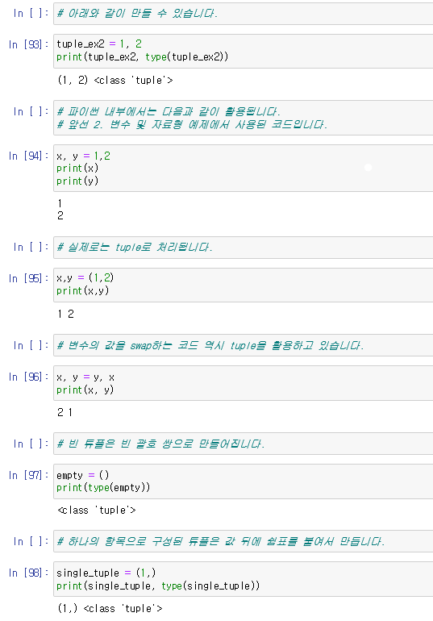
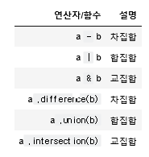
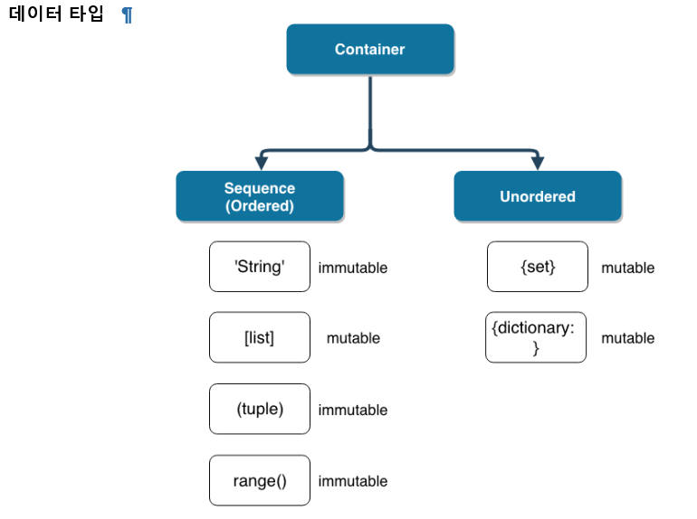

# 01_python_intro

> :star:중점 포인트:star:
>
> - 시퀀스 자료형의 특징과 활용 방법
> - 파이썬에서 독특하게 사용되는 연산자


## 기초 문법

### 주석(comment)

- 주석은 `#`으로 표현한다.
- `docstring`은 `"""`으로 표현한다.
  - 보통 함수/클래스 선언 다음에 이를 설명하기 위해 사용한다.
  - docstring은 다음과 같이 확인할 수 있다. `(함수이름).__doc__`

```python
def mysum(a,b):
    """이것은 덧셈 함수입니다.
    이 줄도 실행되지 않습니다.
    왜 굳이 docstring이라고 이름을 붙였을까요?"""
    print(a + b)
    
mysum.__doc__
```

### 코드라인

- 한줄로 표기하고 싶을 때, `;`을 사용해 표기할 수 있다.

```python
print('hello');print('world')
```

- 여러 줄을 작성할 때는 `\`을 사용하면 된다.

```python
print('\
hello')
```


## 변수(variable) 및 자료형

### 변수

- 변수는 `=`을 통해 할당된다.
- 해당 자료형을 확인하려면 `type()`을 사용한다.
- 해당 변수의 메모리 주소를 확인하려면 `id()`을 사용한다.

```python
user_name = 'arin'
```

```python
type(user_name)
```

```python
id(user_name)
```

### 자료형

#### 숫자형

- int(정수)
- float(실수)
  - 지수를 표현할 때는 `e` ,`E`둘 다 사용 가능
- complex(복소수)
  - 실수부 추출 시 : `(변수이름).real` , 허수부 추출 시 : `(변수이름).imag`
  - 허수부는 `j`로 표현

- bool
  - `True`와 `False`로 이루어져 있다.
  - False로 표현되는 예:
    - `0` , `0.0` , `()` , `[]` , `''` , `None`
- None

#### 문자형

- `''` `""` `"""` 를 활용하여 표현이 가능하다.
- 문자열 안에 문장부호(`'`, `"`)가 사용될 경우 이스케이프 문자(`\`)를 활용 가능하다.

```python
print('진수가 말했다.\'인증샷 제출하세요!\'')
```

- 이스케이프 시퀀스

  - 줄바꿈  `\n`
  - 탭  `\t`

  ```python
  print('애용을 띄어서 출력하고 싶으면?', end='\t')
  print('옆으로 띄어졌다...')
  '''애용을 띄어서 출력하고 싶으면?	옆으로 띄어졌다...'''
  
  print('개행문자 말고도 가능합니다', end='!')
  print('실제로는', end='!')
  print('print는 기본적으로 \\n', end='!')
  '''개행문자 말고도 가능합니다!실제로는!print는 기본적으로 \n!'''
  ```

  - 캐리지리턴 `\r`
  - 널(Null) `\0`
  -  `\`
  - 단일인용부호(`'`)  `\'`
  - 이중인용부호(`"`) `\"`

- String interpolation

  - %-formating
  - str.format()
  - f-string

```python
name = '정아린'
print('Hello, %s' % name)
print('Hello, {}'.format(name))
print(f'Hello, {name}')

'''Hello, 정아린'''
```


## :star:연산자

- `/`는 float 값을 돌려준다. 정수의 결과를 얻고 싶으면 `//`을 사용한다.
- `//`은 몫 `%`은 나머지
- `**`은 거듭제곱

### 논리 연산자에서 단축평가

- `and` , `or` , `not` 

- 첫번째 값이 확실할 때, 두번째 값은 확인하지 않는다.
- 조건문에서 뒷 부분을 판단하지 않아도 되기 때문에 속도가 향상된다.



- :exclamation: a and b
  - `거짓인거 먼저` return,
  - 둘 다 거짓일 때, 첫번째 값 return
  - 둘 다 참일 때, 두번째 값 return
- :exclamation: a or b
  - `참인거 먼저` return
  - 둘 다 참일 때, 첫번째 값 return
  - 둘 다 거짓일 때, 두번째 값 return

#### 기타 연산자

- concatenation

  - 숫자가 아닌 자료형은 `+`로 합칠 수 있다.

    ```python
    'hi' + 'bye'
    
    [1,2,3] + [4,5,6]
    ```

- containment

  - `in`연산자를 통해 요소가 속해 있는지 알 수 있다.

    ```python
    'a' in 'apple'
    
    1 in [1,2,3]
    ```

- identify

  - `is` 연산자를 통해 동일한 object인지 확인 가능하다.

    ```python
    a = 2
    b = 2
    a is b
    ```

- indexing/slicing

  - `[]`을 통해 인덱스값 접근, `[:]`을 통해 리스트를 슬라이싱 가능하다.




## 기초 형변환(Type conversion)



- bool, int, float, complex는 자동적으로 형변환이 가능하다.

  ```python
  True + 2
  # 3
  
  3 + 3.15
  # 6.15
  
  3.0 + (3+5j)
  # 6 + 5j
  ```

  

- string -> int 는 string이 숫자일 때, 형변환 가능 / int -> string은 항상 형변환 가능
- int : string, float를 변환 가능
- float : string, int를 변환 가능
- str : int, float, list, tuple, dictionary를 변환 가능


## :star:시퀀스(Sequence) 자료형:star:

> 데이터가 순서대로 나열된 형식을 나타낸다. (`!주의` : `정렬되었다`라는 뜻은 아니다!!)

- 시퀀스 타입
  - 리스트(list)
  - 튜플(tuple)
  - 레인지(range)
  - 문자열(string)
  - 바이너리(binary)

### 리스트(list)

- `[]` 및 `list()`로 만들 수 있따.
- 값에 대한 접근은 `list[i]`로 한다.

### 튜플(tuple)

- `()`로 묶어서 표현한다.
- 수정이 불가능하고, 읽을 수만 있다.
- 직접 사용하기 보단, 파이썬 내부에서 사용한다.



### range()

- 숫자의 시퀀스를 나타내기 위해 사용
  - range(`n`) -> 0 부터 n-1 까지의 값
  - range(`n, m`)  -> n 부터 m-1 까지의 값
  - range(`n, m, s`) -> n 부터 m-1까지 +s 만큼 증가

### set, dictionary

- set 은 순서가 없는 자료구조
- dictionary는 아이템이 삽입되는 순서를 가짐.

#### set

- {value1, value2, value3}

- `{}` 으로 만들고, `순서 X`  , `중복 X`

- 빈집합을 만들 땐, `set()` / `{} 사용 불가능`

  


#### dictionary

- {Key1:Value1, Key2:Value2, Key3:Value3, **...**}

- `key`와 `value`가 쌍으로 이루어져 있다.
- `{}`나 `dict()`로 만들 수 있다.
- `key`는 immutable한 값이 모두 가능 ex) string, integer, float, boolean, tuple, range
- `value`는 `list`, `dictionary` 를 포함한 모든 것이 가능

```python
phone_book = {'서울' : '02', '경기' : '031'}

phone_book_keys()
# key 값을 확인

phone_book.values()
# value 값을 확인

phone_book.items()
# key, value 값을 확인

phone_book['서울']
# '02'

phone_book.get('서울')
# '02'
```

