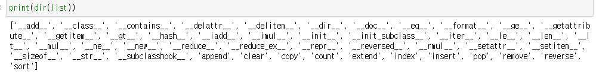
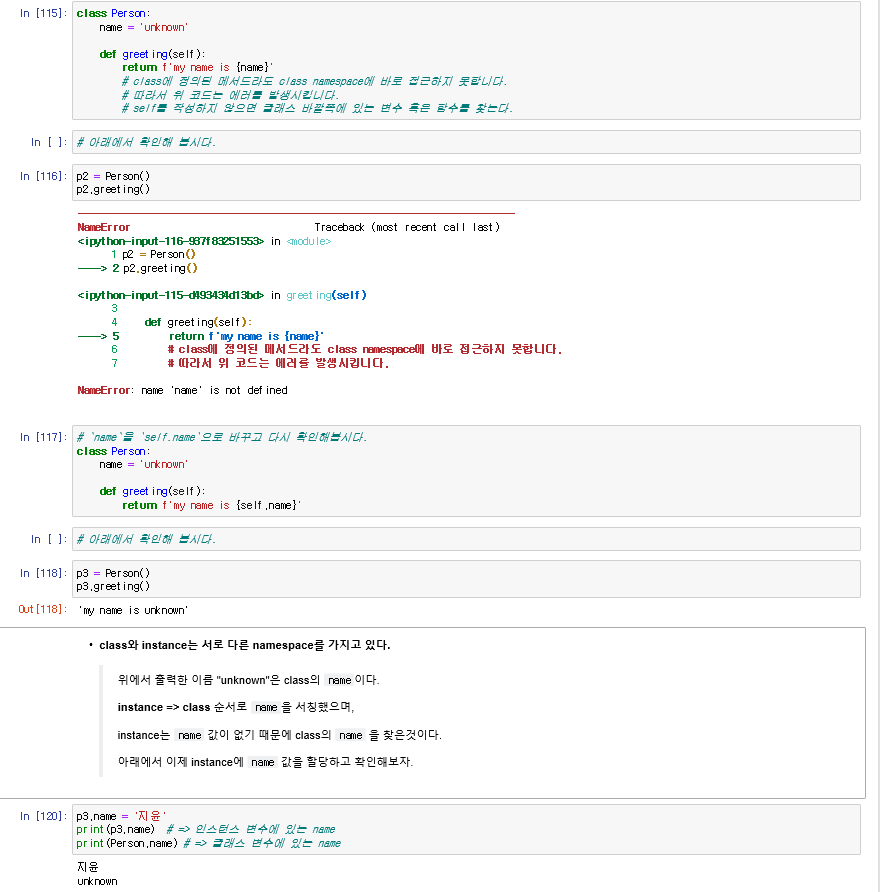
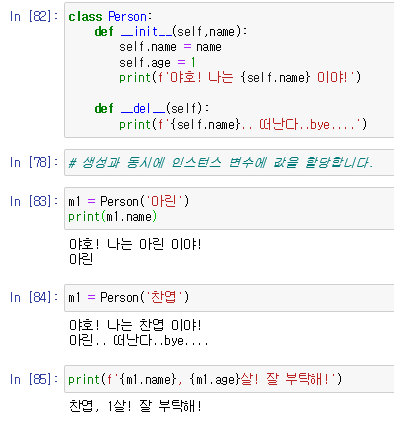
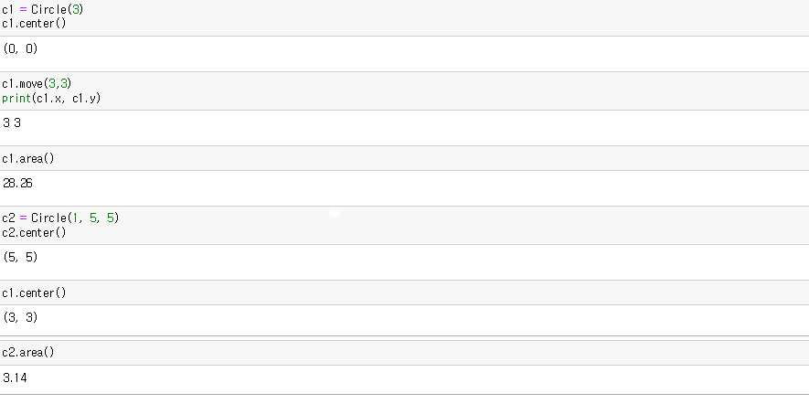
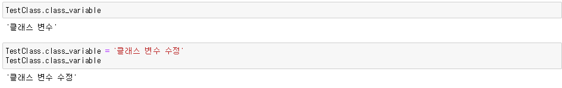
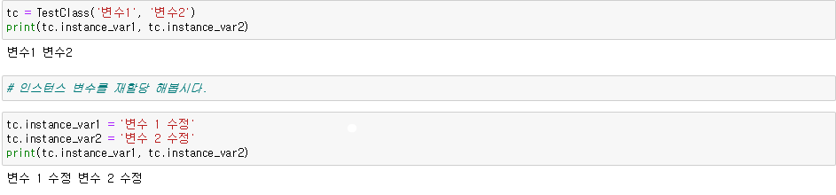

# 07_OOP_basic

>- [클래스와 인스턴스](#클래스-및-인스턴스)
>
>- [클래스의 생성자 소멸자](#클래스의-생성자-소멸자)
>- [클래스 변수, 인스턴스 변수](#클래스-변수)
>- [클래스, 스태틱, 인스턴스 메서드](#인스턴스-메서드)
>- [상속](#상속)

### OOP(Object-Oriented Programing) : 객체 지향 프로그래밍

#### :page_facing_up: 기본 구성요소

#### - 클래스(Class)

- 객체를 표현하는 문법
- `속성(attribute)`와 `행위(behavior)`를 정의한 것
- 객체지향 프로그램의 기본적인 사용자 정의 데이터 형(user define data type)

#### - 인스턴스(instance)

- class의 인스턴스/객체 : 실제 메모리상에 할당된 것
- 고유의 속성(attribute)을 가지고, class에 정의된 행위(behavior)를 수행할 수 있다.
- 객체의 behavior은 class에 정의된 behavior에 대한 method(정의)를 공유하면서 메모리를 경제적으로 사용

#### - 속성(attribute)

- class/instance가 가지고 있는 값

#### - 메서드(Method)

- class/instance가 할 수 있는 행위(behavior)/(함수)


## 객체의 속성(attribute)과 메서드(method)

#### 예시

- class/type - `str`

  instance - `''`  `hello`  `'123'`

  attribute -

  methods - `.capitalize()`  `.join()`  `.split()`

- class/type - `list`

  instance - `[]`  `['a', 'b']` 

  attribute -

  methods - `.append()`  `.reverse()`  `.sort()`

- class/type - `dict`

  instance - `{}`  `{key : value}` 

  attribute -

  methods - `.keys()`  `.values()`  `.items()`

- class/type - `int`

  instance - `0`  `1`  `2`

  attribute - `.real`  `.imag`

  methods - 

---

- 객체가 할 수 있는 모든 것(모든 속성과 메서드) 

  - `dir`

    

## 클래스 및 인스턴스

### :star:클래스 정의하기

- 선언과 동시에 클래스 객체가 생성된다.
- 선언된 공간은 `지역 스코프(local scope)`로 사용된다.
- 정의된 attribute 중 변수는 멤버 변수(클래스 변수)로 불린다.
- 정의된 함수`def`는 `method(메서드)`로 불린다.

```python
class ClassName:
    attribute
    methods
```

### 인스턴스 생성하기

- 인스턴스 객체는 `ClassName()`을 호출함으로써 생성된다.

- 인스턴스 객체와 클래스 객체는 서로 다른 이름 공간을 가지고 있다.

- :star:`instance(인스턴스) -> class(클래스) -> global(전역)` 순으로 탐색한다.

- 클래스는 특정 개념을 표현하는 껍데기고 실제 사용하려면 인스턴스를 생성해야 한다.

  ```python
  # 인스턴스 = 클래스()
  puppy = Dog()
  ```

#### user `without` OOP

:exclamation: 문제점 : ​username/password가 global namespace에 작성되어 이 모듈로는 한사람의 정보만 담을 수 있다.

​				 여러 사람이 로그인을 한다면 같은 모듈을 여러개 만들어야 한다.

```python
# 사용자 정보
username = '정아린'
password = 'dkfls'

# 비밀번호를 바꾸는 기능
def change_password(old_password, new_password):
    global password
    if old_password == password:
        password = new_password
        print('비밀번호가 변경되었습니다.')
    else:
        print('비밀번호가 일치하지 않습니다.')
```

#### user `with` OOP

```python
class User:
    username = ''
    password = ''
    
    # 인스턴스에서 사용한 메서드(인스턴스 메서드)
    # 메서드의 첫번째 매개변수 : self
    def change_password(self, old_password, new_password):
        if old_password == self.password:
            self.password = new_password
            print('비밀번호가 변경되었습니다.')
        else:
            print('비밀번호가 일치하지 않습니다.')
```

```python
user1 = User()                            # 인스턴스 생성
user1.name = '정아린'
user1.password = 'dkfls'
# user1.change_password('dkfls','dkfls@')
User.change_password(user1, 'dkfls', 'dkfls@')
# 비밀번호가 변경되었습니다.

user2 = User()                            # 인스턴스 생성
user2.name= '강찬엽'
user2.password = 'cksduq1!'
# user2.change_password('cksduq1!','cksduq2@')
User.change_password(user2,'cksduq1!','cksduq2@')
print(user2.password)
# 비밀번호가 변경되었습니다.
# cksduq2@
```


#### Python 출력에서 `str` 과 `repr`

- `str` : 객체를 print() 할 때, 보이는 값
- `repr` : 객체 자체가 보여주는 값
- 둘 다 원하는 방식으로 수정 가능

```python
class User:
    username = ''
    password = ''
            
    def __str__(self):
        return 'print 안에 넣으면 이렇게 나오고'
    
    
    def __repr__(self):
        return '그냥 객체만 놔두면 이게 나오지요'
```

```python
user = User()

print(user)
# print 안에 넣으면 이렇게 나오고

user
# 그냥 객체만 놔두면 이게 나오지요
```


### :star2:용어 정리

```python
class Person:						# 클래스 정의(선언, 클래스 객체 생성)
    name = 'unknown'				# 클래스 변수(data attribute:멤버 변수)
    def greeting(self):				# 멤버 메서드 / 인스턴스 메서드
        return f'{self.name}'
```

```python
tim = Person()						# 인스턴스 객체 생성
tim.name							# 클래스 변수 호출
tim.greeting()						# 인스턴스 메서드 호출

# 이름으로 해놓으니깐 조금 헷갈릴 수 있으니깐
person1 = Person()
person1.name
person1.greeting()
```


#### 인스턴스와 객체

- 인스턴스 = 객체 (usually)
- 객체만 지칭할 땐, 그냥 객체
- 클래스와 연관 지을 땐, 인스턴스

```python
a = int(10)
b = int(20)

# a, b 는 객체
# a, b 는 int 클래스의 인스턴스

# a 가 int의 인스턴스인지 알아보는 방법
isinstance(a, int)
type(a)
```


## 실습 1

### MyList 만들기

```python
class MyList:
    data = []
    
    def append(self, n):
        self.data += [n]
    
    def count(self):
        return len(self.data)
    
    def __repr__(self):
        return f'내 리스트 안에는 {self.data}가 들어있다.'
```


## 클래스 변수와 인스턴스 변수

```python
class Dog:
    kind = 'tori'					# 클래스 변수 (모든 인스턴스가 공유)
    
    def __init__(self, name):		# 인스턴스 메서드
        self.name = name			# 인스턴스 변수 (각각의 인스턴스의 고유 변수)
```


### self : 인스턴스 객체 자기자신

- C++ or Java에서 this 키워드와 동일
- :star2: 무조건 메서드에서 `self`를 첫번째 인자로 설정 :star2:
- 메서드는 인스턴스 객체가 함수의 첫번째 인자로 전달되도록 되어있다.


### 클래스-인스턴스간의 이름공간(namespace)

- 클래스를 정의하면, 클래스 객체가 생성 and 이름공간이 생성된다.
- 인스턴스를 만들면 인스턴스 객체가 생성 and 이름공간이 생성된다.
- 인스턴스의 attribute가 변경되면, 변경된 데이터를 인스텐스 객체 이름공간에 저장
- 인스턴스에서 특정 attribute에 접근하면 :star:`인스턴스 -> 클래스` 순으로 탐색




### 클래스의 생성자 소멸자

- `__init__()`
  - 초기화
  - 인스턴스 객체가 만들어진 다음에 호출되는 함수
  - 인스턴스에서 사용할 초기 값들을 초기화 하고 초기화된 새 인스턴스를 얻음
- `__del__()`
  - 소멸자, 파괴자
  - 인스턴스 객체가 소면되기 직전에 호출되는 함수

> 위의 형식처럼 언더스코어가 있는 메서드는 특별한 일을 하기 위해 만들어진 메서드이기 때문에 `스페셜 메서드` 또는 `매직 메서드`라고 한다.   ex) `__something__`

```python
class Person():
    
    def __init__(self):
        print('야호!')
        
    def __del__(self):
        print('bye...')
```

```python
p1 = Person()
# 야호 출력
del p1
# bye... 출력
```

---



## 실습 2

```python
class Stack:
    def __init__(self):
        self.data = []
    
    def empty(self):
        if len(self.data) == 0:
            return True
        else:
            return False
    
    def top(self):
        if len(self.data) == 0:
            return None
        else:
            return self.data[-1]
        
    def pop(self):
        if len(self.data) == 0:
            return None
        else:
            self.data -= self.data[-1]
    
    def push(self, n):
        self.data += [n]
        
    def __repr__(self):
        return ' '.join(map(str,self.data))
```

---

```python
class circle:
    pi = 3.14
    
    def __init__(self, r, x=0, y=0):
        self.r = r
        self.x = x
        self.y = y
    
    def area(self):
        return (self.pi)*(self.r)**2
    
    def circumference(self):
        return 2*self.pi*self.r
    
    def center(self):
        return self.x,self.y
    
    def move(self, x, y):
        self.x = x
        self.y = y
        return self.x,self.y
```



---


# 08_OOP_advanced

```python
class TestClass:
    class_variable = '클래스 변수'
    
    def __init__(self, arg1, arg2):
        self.instance_var1 = arg1
        self.instance_var2 = arg2
        
    def status(self):
        return self.instance_var1, self.instance_var2
```

### 클래스 변수

- 클래스의 속성
- 클래스 선언 블록 최상단에 위치
- `Class.클래스변수이름 `  과 같이 접근(할당)



### 인스턴스 변수

- 각 인스턴스의 고유한 변수
- 메서드 정의에서 `self.인스턴스변수이름`  과 같이  접근(할당)
- 인스턴스 생성 이후 `인스턴스이름. 인스턴스변수이름`  과 같이 접근(할당)




### 인스턴스 메서드

- 인스턴스가 사용할 메서드
- 첫번째 인자는 `self`

### 클래스 메서드

- 클래스가 사용할 메서드
- 정의 위에 `@classmethod` 데코레이터 사용
- 첫번째 인자로 클래스(`cls`)를 받도록 정의, 자동적으로 클래스 객체는 `cls`

### 스태틱(정적) 메서드

- 클래스가 사용할 메서드
- 정의 위에 `@staticmethod` 데코레이터 사용
- 묵시적인 첫번째 인자 받지 않음. 즉, 인자 정의는 자유롭다.
- `어떠한 인자`도 `자동으로 넘어가지 않는다.`


### 인스턴스

> 인스턴스는인스턴스 메서드,  클래스 메서드, 스태틱 메서드에 모두 접근할 수 있다.

- 인스턴스에서 클래스 메서드와 스태틱 메서드는 호출하지 말아야 한다.
- 클래스간 상속이 있을경우 다르게 동작한다.
- 인스턴스가 할 행동은 인스턴스 메서드로 한정 지어서 설계한다.

```python
class MyClass:
    # 인스턴스 메서드
    def instance_method(self):
        return self
    
    # 클래스 메서드
    @classmethod
    def class_method(cls):
        return cls
    
    # 스태틱 메서드
    @staticmethod
    def static_method(arg1, arg2):
        return arg1, arg2
```

```python
# 인스턴스 생성
mc = Myclass()
mc.instance_method() 	# 인스턴스는 인스턴스 메서드에 접근가능
mc.class_method()		# 인스턴스는 클래스 메서드에 접근가능
mc.static_method(1,2)	# 인스턴스는 스태틱 메서드에 접근가능

# Error -> 첫번째 인자가 없다. 자동으로 들어가지 않는다 
mc.static_method()
```

```python
MyClass.class_method()			# 클래스는 자동으로 객체 생성
MyClass.static_method(1,2) 		# 스태틱은 자동으로 인자 생성 안됨.
MyClass.instance_method(mc) # = mc.instance_method()
```

### 클래스

- 클래스도 3가지 메서드에 모두 접근 가능
- 인스턴스 메서드를 호출하지 않는다.
- 해야 할 행동
  - 클래스 자체 `cls`와 그 속성에 접근하려면 클래스 메서드로 정의
  - 클래스와 클래스 속성에 접근 필요 없으면, 스태틱 메서드로 정의

---

#### 실습1

```python
class Doggy:
    num_of_dogs = 0
    def __init__(self, name, age):
        self.name = name
        self.age = age
        Doggy.num_of_dogs += 1
        
    def bark(self):
        return '왈왈!'
    
    @classmethod
    def status(cls):
        return f'현재 {cls.num_of_dogs}마리가 있습니다.'
    
    @staticmethod
    def info():
        return '안녕하세요. 개발자 정아린 입니다. 맘에 안들면 피드백 해주세요.'
```

```python
dg1 = Dpggy('우주', 4)
dg2 = Doggy('행성', 5)
dg3 = Doggy('소녀', 6)

print(Doggy.status())
# 현재 3마리가 있습니다. 출력

print(Doggy.info())
# 안녕하세요. 개발자 정아린 입니다. 맘에 안들면 피드백 해주세요. 출력
```

---

#### 실습 2 (calculator)

```python
class calculator:
    
    @staticmethod
    def add(a, b):
        return a+b
    
    @staticmethod
    def sub(a, b):
        return a-b
    
    @staticmethod
    def mul(a, b):
        return a*b
    
    @staticmethod
    def div(a, b):
        return a//b  
```

:star2: 생성자인 `__init__`을 쓰지 않은 이유 : 어떠한 인자도 자동으로 넘어가지 않기 때문에 필요없다!!:star2:


## 상속

> 클래스의 가장 큰 특징 :`상속`기능을 가지고 있는 것
>
> 부모 클래스의 모든 속성이 자식 클래스에게 상속되므로 코드 재사용성이 높다

```python
class Person:
    population = 0
    
    def __init__(self, name = '김익명'):
		self.name = name
        Person.population += 1
        
    def greeting(self):
        print(f'반갑습니다. {self.name} 입니다.')
```

```python
# Person의 클래스를 상속받아 student 클래스 만들기
class student(Person):
    def __init__(self, student_id, name = '김학생'):
        self.name = name
        self.student_id = student_id
        self.name = name
        Person.population += 1
```

```python
s = Student(20202020)
s.name
# 김학생
s.student_id
# 20202020
s.greeting()					# 부모 클래스에 정의된 메서드를 호출할 수 있다.
# 반갑습니다. 김학생 입니다. 출력
```

```python
# 상속 관계인지 확인할때(class 상속검사)
issubclass(student, Person)
# True
isinstance(s, student)
# True
isinstance(s, Person)
# True

issubclass(bool, int)
# True
issubclass(int, float)
# False
```

---

### Super()

- 자식 클래스에서 메서드를 추가 구현할 수 있다.
- 부모 클래스의 내용을 사용하고자 할 때, `super()` 사용

```python
class Person:
    def __init__(self, name, age, number, email):
        self.name = name
        self.age = age
        self.number =number
        self.email = email
        
    def greeting(self):
        print(f'안녕하세요! {self.name} 입니다.')

class Student(Person):
    def __init__(self, name, age, number, email, student_id):
        # 부모 클래스에 정의되어 있는 내용을 그대로 불러온다.
        super().__init__(name, age, number, email)
        # Student 클래스에서 새롭게 추가할 인스턴스 변수만 정의한다.
        self.student_id = student_id
        
p1 = Person('홍길동', 46, '01012341234', 'hong@gil.dong')
s1 = Student('정아린', 25, '010-7896-7896', 'arin@a.rin', '190000')
```

---

### 실습

```python
class rectangle:
    def __init__(self, width, height):
        self.width = width
        self.height = height
        
    def area(self):
        return self.width*self.height
    
    def perimeter(self):
        return 2(self.width+self.height)
```

```python
rect = Rectangle(4,8)
print(rect.area())
# 32
print(rect.perimeter())
# 24
```

```python
class square(ractangle):
    def __init__(self, length):
        # self.width = length
        # self.height = length
        super().__init__(length, length)
```

---

### 메서드 오버라이딩(method overriding)

- 메서드를 재정의 할 수 있다.
- 상속받은 클래스에서 메서드를 `덮어 쓴다`.

```python
class Person:
    def __init__(self, name, age):
        self.name = name
        self.age = age
        
    def greeting(self):
        print(f'안녕, 난 {self.name}(이)란다!')
```

```python
class Soilder(Person):
    def __init__(self, name, age, level):
        super().__init__(name, age)
        self.level = level
    
    # Method Overriding (덮어 씌우기!!)
    def greeting(self):
        print(f'충성! {self.level} {self.name}')
```

---

### 상속 관계에서 namespace

- 기존 : instance -> class
- instance -> class -> global
- :sparkles: ​`instance -> 자식 class -> 부모 class -> global`

---

### 다중상속 -> 2개 이상의 클래스를 상속 받는 경우

```python
class Person:
    def __init__(self, name):
        self.name = name
        
    def breath(self):
        return '후우'
    
    def greeting(self):
        return f'안녕? 나는 {self.name}이야!'
```

```python
class Mom(Person):
    chromosom = 'XX'
    
    def swim(self):
        return '첨벙첨벙'
    
class Dad(Person):
    chromosom = 'XY'
    
    def walk(self):
        return '성큼성큼'
```

```python
# 상속의 순서가 중요! (왼쪽에서 오른쪽) -> Dad의 chromosom 값을 가져온다.
class FirstChild(Dad, Mom):
    # Mom의 swim 메서드를 오버라이딩한다.
    def swim(self):
        return '찹찹'
    
    def cry(self): # FirstChild만이 가지는 인스턴스 메서드
        return '응애!'
```

