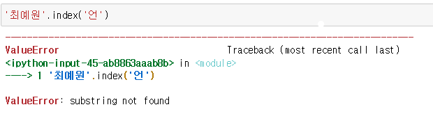
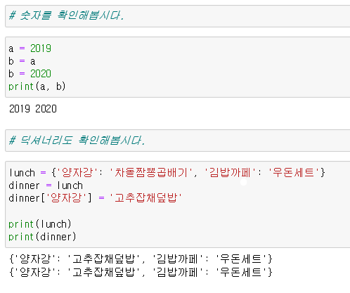
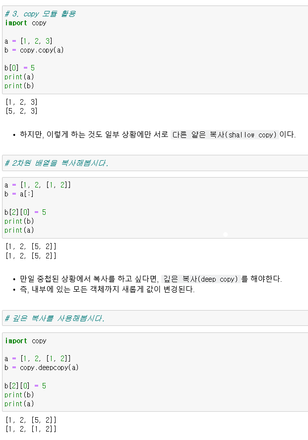
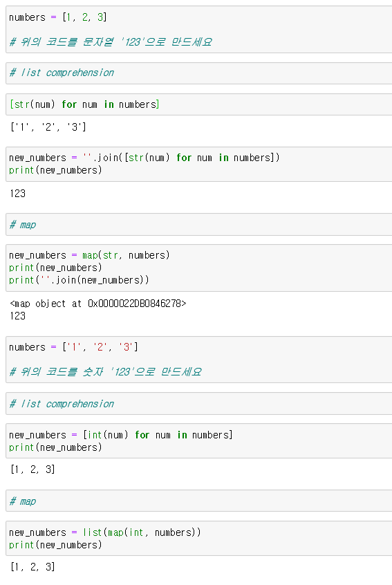
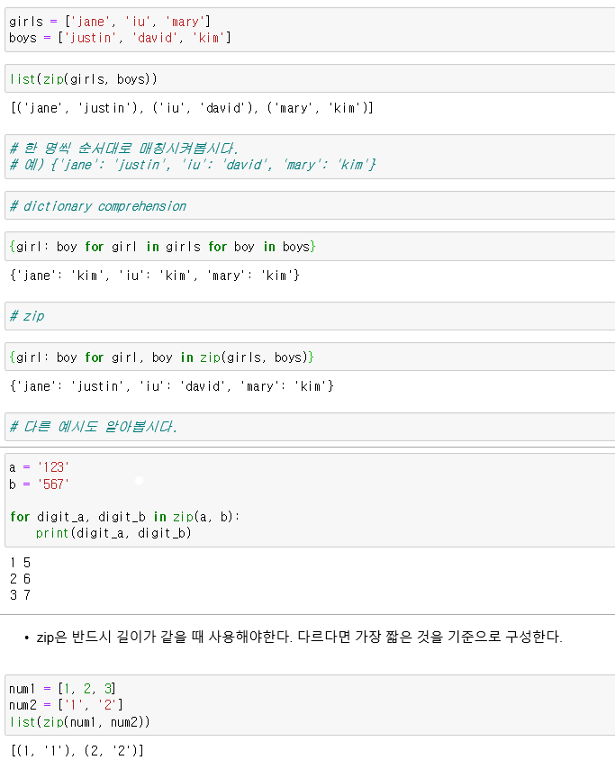
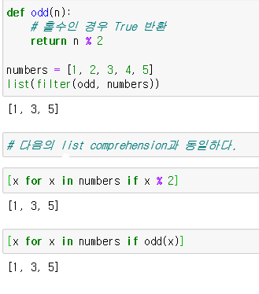

# 04_data_structure

>- [map, zip, filter](#map-zip-filter)
>
>- [comprehension](#List-Comprehension)
>- [리스트 메서드](#리스트-메서드)
>- [딕셔너리 메서드](#딕셔너리-메서드)
>- [copy](#copy)


## 문자열 메서드

### .capitalize()

- 앞글자를 대문자로 만들어 반환

### .title()

- `'` 나 `공백` 이후를 대문자로 만들어 반환

### .upper()

- 모두 대문자로 만들어 반환

### .lower()

- 모두 소문자로 만들어 반환

### .swapcase()

- 대 <-> 소 문자로 변경하여 반환

### .join(iterable)

- 특정한 문자열로 반환
- `iterable` : list, tuple, dictionary, set, string

```python
word = '배고파'

print('!'.join(word))
# 배!고!파  출력
```

### .replace(old, new[, count])

- 바꿀 대상 글자를 새로운 글자로 바꿔서 반환
- count 지정 시, 해당 갯수만큼 시행

```python
'정아리'.replace('리','린')
# 정아린

'정아린'.replace('정', '  ')
#   아린

'정아아아린'.replace('아','',2)
# 정아린
```

### .strip([chars])

- 특정한 chars(문자들)을 지정하면, 양쪽을 제거 or 왼쪽 제거(lstrip) or 오른쪽 제거(rstrip)
- 문자 지정 안하면, 공백 제거

```python
'아린아린정아린아린아린'.strip('아린')
'아린아린정아린아린아린'.strip('린아')
# '정'
```


### 탐색 및 검증

---

### .find(x) : 없으면 -1 반환

- x의 첫번째 위치(인덱스) 반환, 없으면 -1 반환

```python
name = '정아린린린린린'
name.find('린')
# 2
name.find('림')
# -1
```

### .index(x) : 없으면 오류 발생!

- x의 첫번째 위치 반환, 없으면 오류 발생



### .split()

- `리스트`로 반환!

```python
'영인/아린/유빈'.split('/')
# ['영인', '아린', '유빈']
```


### 다양한 확인 메서드

---

### 참, 거짓 반환

### .isalpha()			알파벳

### .isdecimal()		숫자

### .isdigit()

### .isnumeric()

### .isspace()			공백

### .isupper()			대문자

### .istitle()				

### .islower()			소문자

---


## 리스트 메서드

### 값 추가 및 삭제

### .append(x)

### .extent(iterable)

- 리스트에  iterable값을 붙일 수 있다.
- iterable : list, string, range, tuple

```python
cafe = []

cafe.append('starbucks')
print(cafe)
# ['starbucks']

cafe.extend('빽다방')
print(cafe)
# ['starbucks', '빽', '다', '방']

cafe.extend(['착한커피'])
print(cafe)
# ['starbucks', '빽', '다', '방', '착한커피']
```

#### .append(x) / .extend(iterable) 차이점

```python
bakery = []

bakery.append(['paris-baguette'])

bakery.extend(['paris-baguette'])

print(bakery)

# [['paris-baguette'], 'paris-baguette']
```

### .insert(i,x)

- `i`위치에 x 값 추가

```python
cafe = ['starbucks', 'hollys']

cafe.insert(1, 'ediya')
print(cafe)
# ['starbucks','ediya', 'hollys']

cafe.insert(len(cafe), 'last')
print(cafe)
# ['starbucks','ediya', 'hollys', 'last']

cafe.insert(len(cafe)+100000, 'final')
print(cafe)
# ['starbucks','ediya', 'hollys', 'last', 'final']
```

### .remove(x) : 없으면 오류 발생

- 리스트에서 x 삭제 
- 중복되면 앞부분부터 삭제

```python
number = [1,2,3,1,2]

number.remove(1)
print(number)
# [2,3,1,2]

number.remove(1)
print(number)
# [2,3,2]

```

### .pop(i)

- `i`위치 값 삭제, 그 항목 반환
- i 없으면 마지막 항목 삭제 후 반환

```python
a = [1,2,3,4,5]

a.pop(0)
# [2,3,4,5]

a.pop()
# [2,3,4]
```

### .clear()

- 리스트 모든 항목 삭제

```python
number = [1,2,3]

number.clear()
# []
```

---

### 탐색 및 정렬

### .index(x) : 없으면 오류 발생

### .count(x)

- x의 갯수 확인

```python
a = [1,2,3,3,1,1,1]

a.count(1)
# 4
```

```python
# 원하는 값을 모두 삭제하려면 다음과 같이 할 수 있습니다.
a = [1, 2, 1, 3, 4]
target_value = 1

# 지우고자 하는 값의 개수만큼 반복 -> remove 수행
for i in range(a.count(target_value)):
    a.remove(target_value)
```

### .sort()

- 정렬
- 내장함수 `sorted()` 와는 다르게 **원본 list를 변형**시키고, **None**을 리턴합니다.

```python
lotto = [12, 41, 1, 20, 29, 24]

result = lotto.sort()
print(result)
# None
print(lotto)
# [1, 12, 20, 24, 29, 41]

# reverse 인자를 통해 내림차순으로 바꿀 수 있다.
lotto.sort(reverse=True)
print(lotto)
# [41, 29, 24, 20, 12, 1]
```

### .reverse()

- 반대로 뒤집는다. (**정렬 아님!!!**)

```python
numbers = [3, 1, 5, 2]
numbers.reverse()
print(numbers)
# [2, 5, 1, 3]
```

---

## copy

### 복사

- **mutable** 과 **immutable**은 다르게 동작한다.

  


### shallow copy 와 deep copy




## List Comprehension

### [식 **for** 변수 **in** iterable **if** 조건식]

```python
# 짝수 리스트
even_list = [x for x in range(1,11) if x%2==0]

print(even_list)
# [2,4,6,8,10]
```

```python
# 가능한 조합 모두 담기
girls = ['jane', 'iu', 'mary']
boys = ['justin', 'david', 'kim']

pair = [(girls,boys) for girl in girls for boy in boys]
```

```python
# x < y < z < 50 내에서 피타고라스 방정식의 해
result = [(x,y,z) for x in range(1,50) for y in range(x+1,50) for z in range(y+1, 50) if x**2+y**2=z**2]
```

```python
# 모음 제거하기
vowels = 'aeiou'

words = 'Life is too short, you need python!'
result = [char for char in words if char not in vowels]
```


### [식 **if** 조건식 **else** 식 **for** 변수 **in** iterable]


### [식 **if** 조건식 **else** 식 **if** 조건식 **else** 식 **if** **...** **else** **...** **for** 변수 **in** iterable]


---


## 딕셔너리 메서드

### 추가 및 삭제

### .pop(key[ ,default]) : KeyError 발생 가능

- key가 딕셔너리에 있으면 제거하고 그 값을 돌려줍니다. 그렇지 않으면 default를 반환
- default가 없는 상태에서 딕셔너리에 없으면 **KeyError**가 발생

```python
mydict = {'apple': '사과', 'banana': '바나나'}

mydict.pop('apple')
# '사과'

mydict.pop('melon')
# 오류 발생!!!!!!!!!!!!!!!!!!  -> KeyError

mydict.pop('melon',0)
# 0
```

### .update()

```python
mydict = {'apple': '사과', 'banana': '바나나', 'melon': '멜론'}

mydict.update(apple='사과과과과과')

print(mydict)
# {'apple': '사과과과과과', 'banana': '바나나', 'melon': '멜론'}
```

### .get(key[, default]) : KeyError 발생 불가능

- key를 통해 value 가져옴
- 기본적으로 **dafault 는 None**

```python
mydict = {'apple': '사과', 'banana': '바나나', 'melon': '멜론'}

print(my_dict.get('pineapple'))
# None
print(my_dict.get('apple'))
# 사과
print(my_dict.get('pineapple', 0))
# 0
```


## Dictionary Comprehension

### {키: 값 **for** 키, 값 **in** 딕셔너리} 

```python
cubic = {x : x**3 for x in range(1,8)}
print(cubic)
# {1: 1, 2: 8, 3: 27, 4: 64, 5: 125, 6: 216, 7: 343}
```


### dict({키: 값 **for** 키, 값 **in** 딕셔너리}) 

### {키: 값 **for** 키, 값 **in** 딕셔너리 **if** 조건식} 

```python
#  미세먼지 농도가 80 초과 지역 찾기
dusts = {'서울': 72, '대전': 82, '구미': 29, '광주': 45, '중국': 200}

result = {key : value for key, value in dust.items() if value>80}
print(result)
# {'대전': 82, '중국': 200}
```


### {키: 값 **if** 조건식 **else** 값 **for** 키, 값 **in** 딕셔너리}

```python
# 미세먼지 농도가 80초과는 나쁨 80이하는 보통으로 하는 value를 가지도록 바꾸세요.
result = {key:'나쁨' if value>150 else '보통' if value>80 else '좋음' if value>30 for key, value in dust.items()}
```


---

## 세트 메소드

:star: 세트에 들어가는 요소는 중복 될 수 없다.

### 추가 및 삭제

### .add(elem)

### .update(*others)

- iterable한 값을 넣어야 한다!

### .remove(elem) : 없으면 KeyError 발생

### .discard(elem) :없어도 KeyError 발생 :x:

### .pop()


## map zip filter

### map(function, iterable)

- iterable한 타입 - list, dict, set, str, bytes, tuple, range

- return은 `map_object` 형태



### zip(*iterable)

- 복수의 객체를 모아줌
- 결과는 튜플의 모음으로 구성된 `zip object` 를 반환

- **zip은 반드시 길이가 같을 때 사용해야한다. 다르다면 가장 짧은 것을 기준으로 구성한다.**





### filter(function, iterable)

- iterable에서 function의 반환된 결과가 `True` 인 것들만 구성하여 반환
- `filter object` 를 반환



