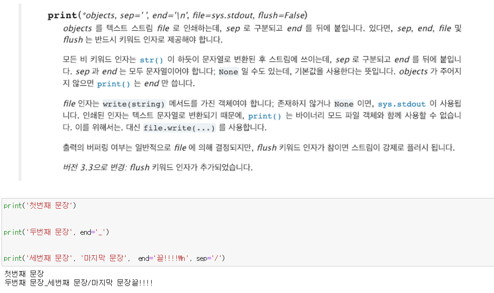
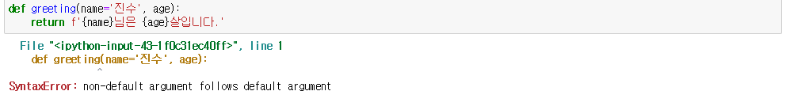

# 03_Function

>함수 인자의 종류
>
>함수의 리턴
>
>스코프


- 내장함수 목록 알아보기

  - dir(`__builtins__`)

  - print()도 파이썬 표준 라이브러리 내장함수

    


#### Parameter(매개변수) & Argument(인자, 전달인자)

- def func(`x`) :`x`는 매개변수
- func(`1`) : `1` 은 인자


## 함수의 `Return`

- 오직 한 개의 객체만 return
- 함수가 return 하거나 종료되면 함수를 호출한 곳으로 돌아감.


## 함수의 `인자`

- 함수는 인자를 넘겨줄 수 있다.

### 위치 인자(positional arguments)

- 함수는 기본적으로 인자를 위치로 판단.

```python
def cylinder(r, h):
    return 3.14 * r**2 * h

cylinder(6, 2)
```

### 기본 인자값(default argument values)

- 함수가 호출될 때, 인자를 지정하지 않아도 기본값을 설정할 수 있다.

```python
def func(p1=v1):				# v1으로 기본값을 설정해 놓았다.
    return p1
```


#### :boom: 기본인자값 설정 이후 기본값이 없는 인자를 사용할 수 없다.:boom:




### 키워드 인자(keyword arguments)

- 키워드 인자는 직접 변수의 이름으로 특정 인자를 전달할 수 있다.

```python
def greeting(age, name='아린'):
    return f'{name}은 {age}살입니다.'
```

#### :star2:  키워드 인자 중요 포인트 :star2:

```python
greeting(age = 26, name = '지윤')			# 키워드 인자사용
greeting(26, name='지윤')					# 위치인자, 키워드 인자 사용
greeting(name = '지윤', age = 26)			# 키워드 인자 위치 바꾸기 가능
greeting(26, '지윤')						# 위치 인자 사용

greetinf(age=26, '지윤')					# 키워드 인자 -> 위치인자 사용 불가능!!!!
```


### `가변인자 `리스트(arbitraty argument lists)

- print() 처럼 개수가 정해지지 않은 임의의 인자를 받기 위해서 가변인자 사용
- `tuple`형태로 처리되며, 매개변수에 `*`표현

```python
def func(a, b, *args):
```

> `*args` 는 임의의 객수의 위치인자를 받음을 의미
>
> 이 가변인자 리스트는 `형식 인자 목록의 마지막`에 온다.

```python
def func(*args):
    return args
```

```python
print(func(1,2,3,4,5))
# (1,2,3,4,5) 출력 
# tuple 형태로 출력
```

---

#### 실습

```python
# 최댓값 찾기
def mymax(*args):
    result = 0
    
    for idx, val in enumerate(args):
        if idx = 0:						# 리스트에 아무것도 없거나 하나밖에 없을 때
            result = val				
        else:							# 리스트에 두개의 숫자 이상 있을 때
            if val>result:				# 숫자 비교
                result = val
                
    return result
```

---

### 정의되지 않은 키워드 인자 처리하기

- 정의되지 않은 키워드는 `dict` 형태로 처리, `**`로 표현
- `kwagrs` 이름 사용, `**kwagrs`를 통해 인자를 받아 처리 가능

