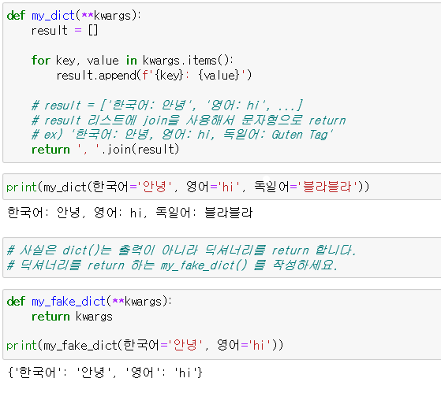
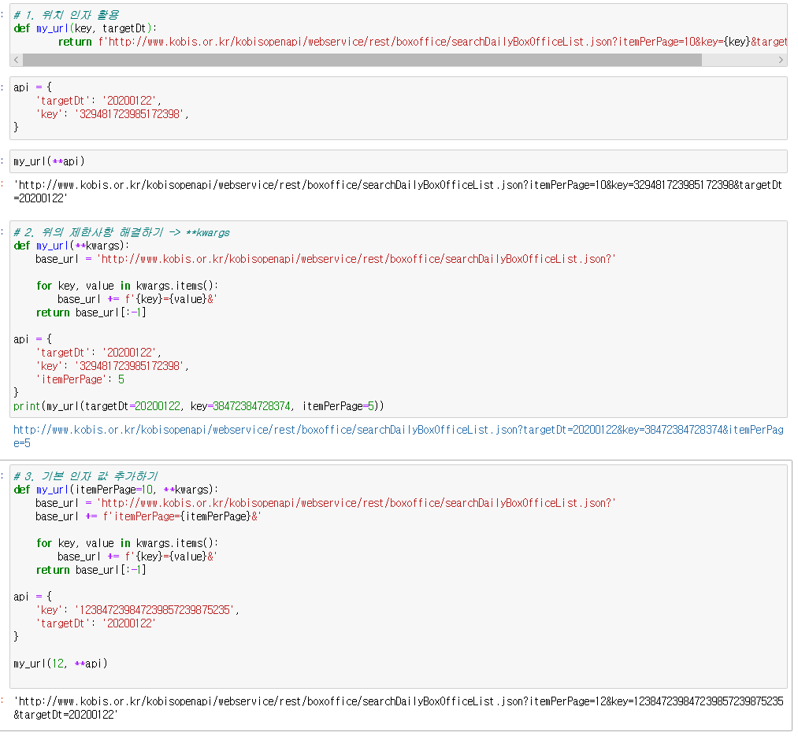
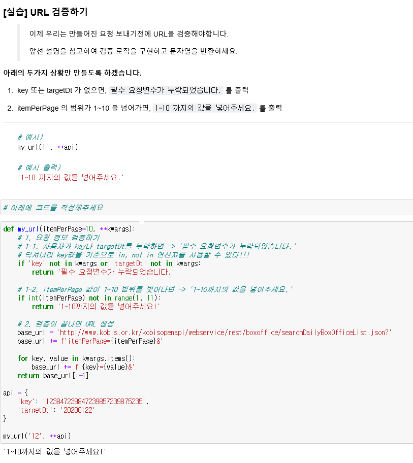
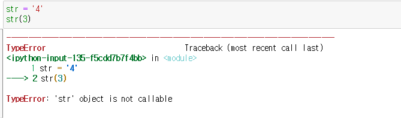

# 03_Function

>[함수의 인자](#함수의-인자)
>
>[함수의 리턴](#함수의-return)
>
>[스코프](#이름-공간(namespace))


- 내장함수 목록 알아보기

  - dir(`__builtins__`)

  - print()도 파이썬 표준 라이브러리 내장함수

    


#### Parameter(매개변수) & Argument(인자, 전달인자)

- def func(`x`) :`x`는 매개변수
- func(`1`) : `1` 은 인자


## 함수의 `Return`

- 오직 한 개의 객체만 return
- 함수가 return 하거나 종료되면 함수를 호출한 곳으로 돌아감.


## 함수의 인자

- 함수는 인자를 넘겨줄 수 있다.

### 위치 인자(positional arguments)

- 함수는 기본적으로 인자를 위치로 판단.

```python
def cylinder(r, h):
    return 3.14 * r**2 * h

cylinder(6, 2)
```

### 기본 인자값(default argument values)

- 함수가 호출될 때, 인자를 지정하지 않아도 기본값을 설정할 수 있다.

```python
def func(p1=v1):				# v1으로 기본값을 설정해 놓았다.
    return p1
```


#### :boom: 기본인자값 설정 이후 기본값이 없는 인자를 사용할 수 없다.:boom:


### 키워드 인자(keyword arguments)

- 키워드 인자는 직접 변수의 이름으로 특정 인자를 전달할 수 있다.

```python
def greeting(age, name='아린'):
    return f'{name}은 {age}살입니다.'
```

#### :star2:  키워드 인자 중요 포인트 :star2:

```python
greeting(age = 26, name = '지윤')			# 키워드 인자사용
greeting(26, name='지윤')					# 위치인자, 키워드 인자 사용
greeting(name = '지윤', age = 26)			# 키워드 인자 위치 바꾸기 가능
greeting(26, '지윤')						# 위치 인자 사용

greetinf(age=26, '지윤')					# 키워드 인자 -> 위치인자 사용 불가능!!!!
```


### `가변인자 `리스트(arbitraty argument lists)

- print() 처럼 개수가 정해지지 않은 임의의 인자를 받기 위해서 가변인자 사용
- `tuple`형태로 처리되며, 매개변수에 `*`표현

```python
def func(a, b, *args):
```

> `*args` 는 임의의 객수의 위치인자를 받음을 의미
>
> 이 가변인자 리스트는 `형식 인자 목록의 마지막`에 온다.

```python
def func(*args):
    return args
```

```python
print(func(1,2,3,4,5))
# (1,2,3,4,5) 출력 
# tuple 형태로 출력
```

---

#### 실습

```python
# 최댓값 찾기
def mymax(*args):
    result = 0
    
    for idx, val in enumerate(args):
        if idx = 0:						# 리스트에 아무것도 없거나 하나밖에 없을 때
            result = val				
        else:							# 리스트에 두개의 숫자 이상 있을 때
            if val>result:				# 숫자 비교
                result = val
                
    return result
```

---

### 정의되지 않은 키워드 인자 처리하기

- 정의되지 않은 키워드는 `dict` 형태로 처리, `**`로 표현
- `kwagrs` 이름 사용, `**kwagrs`를 통해 인자를 받아 처리 가능



---

### 인자 리스트 언패킹(unpacking arguments lists)

- packing : 여러개의 값을 하나의 컬렉션으로 묶어 변수에 대입
  - collection = 1, 2, 3
- unpacking : 컬섹션 속의 요소들을 여러개의 변수에 나누어 대입
  - a, b, c = collection

```python
list(range(3,6))
# [3,4,5]

args = [3,6]
list(range(*args))
# [3,4,5]
```

---

### :exclamation:  가변인자 + 정의되지 않은 키워드 인자

```python
def person(*args, **kwargs):
    return args, kwargs
```

```python
result = person('아린', '경은', '예원', 취미='쇼핑', 특기='운동')
print(result)

# (('아린', '경은', '예원'), {취미:'쇼핑', 특기:'운동'})
```

---


### 실습

- 로그인 검증 예제
- 여기서 strip()은 양쪽의 특수기호나 공백을 지워주는 것.

```python
def login(username, password, password_confirmation):
    if username.strip() == '' or password.strip() == '':
        return '장난하지 마세요.'
    if len(password) < 8:
        return '비밀번호는 8자리 이상 적으세요!'
    
    if password == password_confirmation:
        return f'{username}님 가입 완료! 축하축하 :)'
    else:
        return f'비밀번호와 비밀번호 확인이 일치하지 않아요!'
```

```python
my_account = {
    'username': '        ',
    'password': '1q2w3e4r',
    'password_confirmation': '1q2w3e4r'
}

login(**my_account)
# '장난하지 마세요.' 출력
```

---

#### 실습 2 : URL



---



---

### 이름 공간(namespace)

#### :star:LEGB Rule

- `L`ocal scope : 정의된 함수
- `E`nclosed scope : 상위 함수
- `G`lobal scope : 함수 밖의 변수 혹은 import된 모듈
- `B`uilt-in scope : 파이썬 내장 함수 또는 속성

---



1. `str()` 코드가 실행되면
2. 함수에서 실행된 코드가 아니기 때문에 `L`, `E` 를 스킵하고,
3. str 을 Global scope에서 찾아서 `str = 4`를 가져오고, 
4. 이는 함수가 아니라 변수이기 때문에 `not callable`하다라는 오류를 내뱉게 됩니다.
5. 우리가 원하는 `str()`은 Built-in scope에 있기 때문입니다.

---

#### Global scope를 바꾸고 싶을 때

```python
global_num = 3   # 전역변수(Global Variable)

def localscope():
    global_num = 5    # 지역변수(Local Variable)
    return f'global_num이 {global_num}으로 바뀌었습니다!'

print(localscope())
# global_num이 5으로 바뀌었습니다!
print(global_num)
# 3
```

```python
global_num = 3   # 전역변수(Global Variable)

def localscope():
    global global_num				# 함수 안에 글로벌을 선언한다.
    
    global_num = 5
    return f'global_num이 {global_num}으로 바뀌었습니다!'

print(localscope())
# global_num이 5으로 바뀌었습니다!
print(global_num)
# 5
```

---

### 이름 공간의 `수명 주기`

- built-in names: 파이썬이 실행된 이후부터 영원히 유지

- global namespace : 모듈이 호출된 시점 이후 혹은 이름 선언된 이후부터 인터프리터가 끝날때 까지 유지

- local namespace : 함수가 호출될 때 생성되고, 함수가 가 종료될 때까지 유지 (함수 내에서 처리되지 않는 예외를 일으킬 때 삭제됨)

---


## 재귀 함수(recursive function)

> 함수 내부에서 자기 자신을 호출하는 함수
>
> 알고리즘 구현 시 유용


